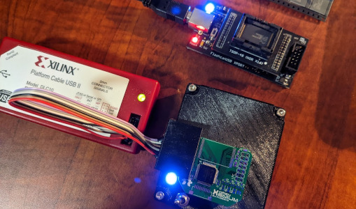
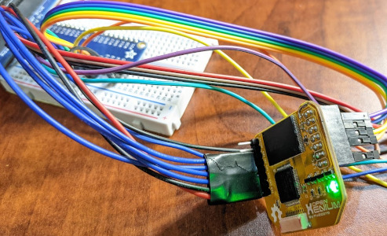
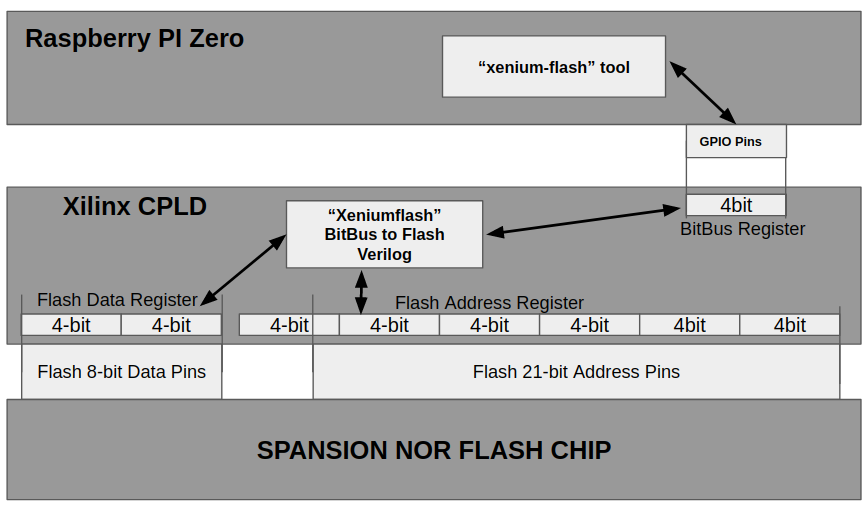
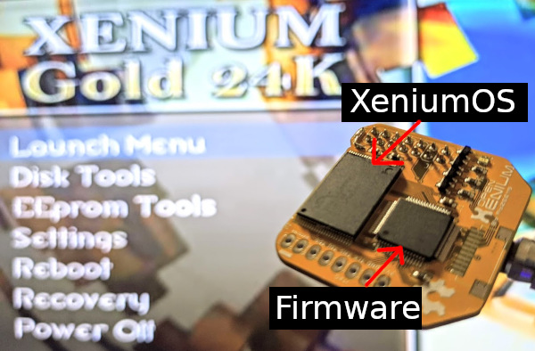

# OpenXenium JTAG and Flash Memory programmer

#### The tools in this repo will allow you to use a Raspberry PI to pogram an OpenXenium chip with the Xilinx CPLD Firmware  via JTAG and will also upload a XeniumOS images into the OpenXenium Flash memory via a custom 4-bit bus NOR Flash programming protocol. 

Scroll down to  the -- INSTALLING THE XENIUM PROGRAMMER -- section to skip the write-up.. :)

### NOTE: This has only been tested on PI Zero W and PI 3B+ models so far.

-------------
## How does a "Original XBOX Mod" chip work?
Running unsigned code on the Original XBOX has been around for almost the entire 20 years of the console's existence here is a very high level explanation of how modern mod chips forces an external BIOS to load on Original XBOX.

- The Original Xbox (OGX) is a plain vanilla Intel CPU and NVidia GPU system and runs a watered down Windows based Kernel. So for all practical purposes its pretty much a Windows PC.

- The Kernel, along with boot loaders are encrypted and stored onboard a Flash chip, termed the "TSOP" chip. 

- When the System starts up, the South Bridge (MCPX) has hard coded instructions to load the BIOS from the TSOP chip, validate signatures and start boot loader execution. If your BIOS is not signed by MS and does not match the hardware embedded signature, the MCPX will abort. (More on that for a later repo ;) )

- One small (but very important) detail is that the MCPX will check the value of bit 0 at address 0 of the TSOP and if it has the value 0, it will abandon loading the BIOS from TSOP and will instead revert to loading a BIOS from the onboard Low Pin Count (LPC) bus!

- So, by grounding the TSOP chip Data 0 line (D0) you can force a 0 value on bit 0 at address 0 and the MCPX will load a BIOS externally! This works on all OGX motherboard revisions 1.0 - 1.4  (Thanks Microsoft!!)

- Microsoft finally patched this loophole with the OGX 1.6 motherboard and completely removed the TSOP chip and embedded a BIOS in their own custom silicon that ONLY loads via LPC bus.  But they were also nice enough to honor the LPC Abort signals, so you can easily abort the onboard LPC BIOS on startup and again inject your own via the LPC bus.. (Thanks Microsoft!!)

- So - What does a mod chip do?  Well, its pretty easy, it simply asserts D0 to ground on motherboard revision 1.0-1.4 boards or it aborts the onboard LPC BIOS on 1.6 boards and makes its own BIOS available on the LPC bus for the MCPX to load!

## How do you inject a BIOS on the LPC bus?

The OGX BIOS is only 256kb in size and although the MCPX loads the top 16MB via the LPC bus, its really the same 256kb repeated x64 times. Some of the very first LPC mod chips were simply just SST-49LF040A LPC based 256kb flash memory chips that you connected directly to the motherboard LPC bus and grounded TSOP pin D0 to force the MCPX to load the BIOS from your external chip!  The 1.6 version board requires a Quick Solder Board (QSB) to re-instate some removed LPC bus wires Microsoft removed, but you can still do this on 1.6 boards with some wiring tricks.

More modern mod chips however does a very clever trick where they store a larger or even multuple BIOS images in a large NOR parallel flash chip that requires 21-Address + 8-Data + 2-Control pins to read data. These clever mod chips then employ a Complex Programmable Logic Device (CPLD) in the between the parallel NOR flash and the LPC bus to act as a bridge between the two!!  Essentially the CPLD takes incoming LPC protocol requests and translates them to parallel NOR flash requests and vice versa..  The MCPX all the while thinks it is speaking to a LPC chip and doesnt know the difference!!

## OpenXenium by Ryzee119

One such a "modern" mod chip was the Xenium that sported a 1MB parallel flash (enough for 4x256kb BIOS or 2x512kb or 1x1mb or any combaniation of these) and a Xilinx CPLD in the middle to do the LPC translation. Unfortunately after 20 years it became extinct and is no longer available. But, thanks to the VERY clever work by the super talented Ryzee119 (who reverse engineered this mod chip entirely from scratch), we today have the "Open Xenium" that is a 100% complete version of the original Xenium mod chip! And to top it all, its completely free Open Source!!

THANKS RYZEE119!!!!

See: https://github.com/kooscode/OpenXenium

-------------
## Programming the OpenXenium

Ryzee119 provides the Xilinx CPLD's source code for LPC translation, but you still need to implement/compile the VHDL source code into a bitsream for the CPLD and then program that into the CPLD via a JTAG programmer (Think of it as compiling and uploading the CPLD firmware) And on top of that, once the Xilinx CPLD is programmed, you need to also upload the BIOS image into the paralel NOR Flash chip. 

- Uploading the CPLD firmware can be done using a a select few JTAG programmers, but the official Xilinx programmers are expensive (about $250) and hard to use and most people do not have access to them. 

- Uploading the BIOS to Flash memory can be done prior to installing the chip on the Xenium board via NOR Flash programmer, but that is also expensive (about $60), cumbersone and most people do not have access programmers or the bare Flash chip prior to it being soldered onto the Xenium board..  

- You can also upload the BIOS via an already modded XBOX by hot swapping an existing LPC mod chip with a blank OpenXenium chip and using Ryzee119's xenium-tools, but that kinda defeats the purpose of using an already modded XBOX.

-------------
## The $5 JTAG and Parallel NOR Flash programmer!!  

I recently ran across a web article that showed JTAG programming a Xilinx FPGA via a Raspberry PI using a tool called XC3SPROG and I thought that would be a great platform to program a Xenium's CPLD !!

See: https://linuxjedi.co.uk/2020/12/01/programming-xilinx-jtag-from-a-raspberry-pi/

Now - if you can also get it to upload the BIOS to the Xenium Flash memory, that would make the PERFECT little Xenium programmer and for $5 more, you can make it a wireless remote and even standalone end-to-end OpenXenium mod chip programmer!!

I downloaded the XC3SPROG tool and it worked fantastic! I could JTAG program the Xilinx CPLD in 12 seconds flat!! 

So, I set about looking at how to bit-bang LPC through the Raspberry PI's GPIO ports and program Xenium Flash memory.

This turned out to be a little harder and very slow.. I could not get less than about 10 minutes of programming time and finally abandoned that idea.. 

So, then I tried implementing a SPI Slave in Verilog HDL, so instead of OGX's LPC bus, I can turn the Xenium CPLD into the more common SPI to NOR Flash bridge/translator. The Xenium Already had a nifty SPI connector that I could re-use too!

This worked really great, except it was SLOOOOW... The problem is that the Xenium CPLD does not have an onboard oscillator and relies on the XBOX LPC 33Mhz Clock and i tried feeding it a clock from the PI's GPIO ports, but could never get above 8Mhz clock and 1Mhz SPI bus..  And since SPI is essentially a 1-bit bus, it took about 8 minutes to program the 1MB of flash via SPI. So sad..

Back to the drawing board!!...

## A Fast 4-bit parallel "BitBus" 

I decided to re-purpose the LPC bus header and write Verilog HDL code that will stream 4-bits at a time and translate that directly into the parallel flash programming/reading sequences. Think of it as a shift register, but instead of shifting 1-bit at a time for the 21-bit address and 8-bit data (29-bits), i would just bang 4-bits in/out at a time and can clock the 4-bit data in/out manually and control direction via seperate GPIO pins..  The LPC header exposes 7 pins in the CPLD, so I should have plently re-usable pins! 

I dubbed thee "BitBus" and was able to move data in and out of the flash pretty speedily.. I then wrote an app (xenium-flash) in C++ for the PI to control and upload data using GPIO pins to the Xenium Flash via the "BitBus" CPLD translator in the middle and a decent speed.

### Wooho!! Now I can program the Xenium CPLD and the Flash Menory!!

- I used the `XC3SPROG` tool to program the CPLD with my "BitBus CPLD" firmware
- Then I used my `xenium-flash` tool to upload the flash image to the Xenium Flash memory via my custom fast 4-bit "BitBus"
- And finally, I used the `XC3SPROG` tool again to program the Xilinx CPLD with Ryzee119's OpenXenium Firmware!!

### BOOM! We have lift off!!!

-------------
## -- INSTALLING THE XENIUM PROGRAMMER -- 

You can install Xenium Programmer stack by doing the following: 

- Clone this repo by running `git clone https://github.com/kooscode/xenium-programmer.git`
- Then change the `install` script to be executable by doing a `chmod +x install`
- Finally run `./install` script to download, build and install all the above mentioned tools
- This might take a while - please be patient!

-------------
## -- HOOKING UP THE HARDWARE --

### JTAG PROGRAMMING PINS
- You need to hook up the JTAG pins for XC3SPROG in a specific way.. AFAIK, they are not configurable.. 

### -- FLASH PROGRAMMING PINS --
- These pins are configurable in the `BitBus.cpp` file of the `xenium-flash` app source.
- I chose these pins purely for convenience of my board layout, use them as as, or change it as you see fit.. 

-------------
## -- PROGRAMMING A XENIUM CPLD AND FLASH MEMORY --

This repo includes the OpenXenium Firmware as well as the XeniumOS 2.3.1 images for BLUE, GOLD and ICE themes.

- You can upload any XeniumOS image to the Xenium Flash by using the `xenium-programmer` in the root of this repo
- NOTE - The xenium-programmer tool, already has the Bitbus and OpenXenium firmware locations built in!
- For example to program the XeniumOS GOLD you would run: `./xenium-programmer xenium-bin/xenium_blue.bin` 

-------------
## -- CREDITS --
### Created by Koos du Preez - kdupreez@hotmail.com

### Ryzee119: For OpenXenium Firmware and hardware and all round awesomeness!
### XC3SPROG: Not sure who to thank here, but it wont be possible without this tool :)
